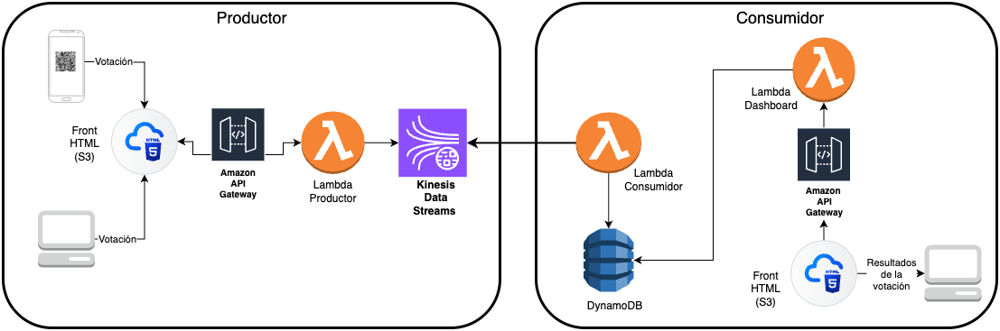

# 🏎️ Procesamiento de Datos en Tiempo Real con AWS Kinesis — Demo **F1 Voting**

Este repositorio contiene un **demo de votaciones en tiempo real** construido con servicios serverless de AWS. La idea: mostrar cómo **Amazon Kinesis** permite recibir eventos en streaming y procesarlos en tiempo real, desacoplando productores y consumidores para lograr escalabilidad y resiliencia.

---

## 📌 Resumen arquitectónico

**Flujo principal**

```
Frontend (S3) 
  → POST /vote (API Gateway) 
    → Lambda Producer 
      → Kinesis Data Stream 
        → Lambda Consumer 
          → DynamoDB (conteos)
  → Dashboard (S3) → GET /results (API Gateway) → Lambda Results → DynamoDB
```



**Componentes clave**
- **S3**: frontends estáticos (`vote.html`, `dashboard.html`, `config.json`).
- **API Gateway**: expone `/vote` (POST) y `/results` (GET).
- **Lambda Producer**: recibe POST y hace `put_record` a Kinesis.
- **Kinesis Data Stream**: buffer/stream en tiempo real (shards).
- **Lambda Consumer**: trigger Kinesis → decodifica registros → `UpdateItem` en DynamoDB.
- **DynamoDB**: almacena conteos por opción.
- **Lambda Results**: endpoint que lee DynamoDB y devuelve JSON al dashboard.

---

## 🧰 Requisitos previos

- Cuenta AWS con permisos para crear: Lambda, API Gateway, Kinesis, DynamoDB, S3, IAM, CloudWatch.
- AWS CLI configurado (opcional, para comandos).
- Navegador para probar el frontend.

---

## 🚀 Quick start (paso a paso)

- 1.- `README_vote.md` — desplegar y configurar `vote.html`.
- 2.- `README_kinesis_Stream.md` — crear stream en Kinesis (detallado).
- 3.- `README_lambda_producer.md` — configuración y variables del producer.
- 4.- `README_lambda_consumer.md` — configuración y tabla DynamoDB.
- 5.- `README_dashboard.md` — desplegar `dashboard.html` en S3 (CORS, config.json).


---

## 📁 Estructura del repo

```
/demo-f1-voting-kinesis
│── frontend/
│   ├── vote.html
│   ├── dashboard.html
│   ├── config.json
│── lambdas/
│   ├── lambda_producer.py
│   ├── lambda_consumer.py
│   ├── lambda_vote_results.py
│── architecture.png
│── README.md
│── README_vote.md
│── README_kinesis_Stream.md
│── README_lambda_producer.md
│── README_lambda_consumer.md
│── README_dashboard.md
```

---


## ✨ Cierre y créditos

Demo creada para **AWS Community Day Bolivia 2025**.  
Autora: **Silvana Gutiérrez M.** — Expert Backend Developer | Cloud & Data Enthusiast.

Si te gustó esta demo y quieres más ejemplos/prácticas sobre streaming, BigQuery/agents o automatización de pipelines, ¡sígueme y con gusto comparto más! 🚀
